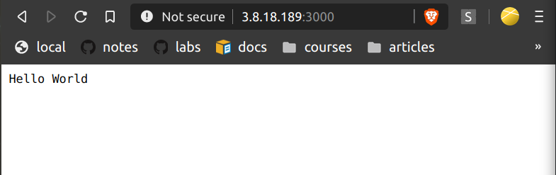

# vpc-simple - aws-cli

`aws-cli` commands for creating a simple, non-default VPC from scratch with an IPv4 CIDR block and public and private subnet in the VPC as well as installing a basic node app and removal of the VPC.

**Resources**

* [Create an IPv4 VPC and Subnets using the AWS CLI](https://docs.aws.amazon.com/vpc/latest/userguide/vpc-subnets-commands-example.html)
* [Creating a simple Hello World web application - Effective DevOps with AWS](https://learning.oreilly.com/library/view/effective-devops-with/9781789539974/792582d6-cf33-49f5-bd53-2c381cb4a19d.xhtml)
* [Allocating an Elastic IP](https://docs.aws.amazon.com/AWSEC2/latest/UserGuide/elastic-ip-addresses-eip.html#using-instance-addressing-eips-allocating)
* ```aws ec2 describe-vpcs | grep VpcId```
* ```aws ec2 reboot-instances --instance-ids i-055e8723e62f01931```


## creation

0. Remove the default VPC (if applicable)
1. Create a **VPC** with a 10.0.0/16 **CIDR block**.

        aws ec2 create-vpc --cidr-block 10.0.0.0/16
    Note the VPC ID that's returned

        {
                "Vpc": {
                        "VpcId": "vpc-02b9e5f07f84bf0ea", 
                ...
                }
        }
2. Create a **subnet** with a `10.0.1.0/24` CIDR block

        aws ec2 create-subnet --vpc-id vpc-02b9e5f07f84bf0ea --cidr-block 10.0.1.0/24

3. Create a **second subnet** in the VPC with a 10.0.0.0/24 CIDR block.

        aws ec2 create-subnet --vpc-id vpc-02b9e5f07f84bf0ea --cidr-block 10.0.0.0/24

4. Make one of the subnets public by: attaching an **internet gateway** to your VPC

        aws ec2 create-internet-gateway
        ...
        aws ec2 attach-internet-gateway --vpc-id vpc-02b9e5f07f84bf0ea --internet-gateway-id igw-0ffc9f60794a3d670

5. Continue making one of the subnets public by: creating a **custom route table** and configuring routing to the internet gateway.

        aws ec2 create-route-table --vpc-id vpc-02b9e5f07f84bf0ea
        ...
        aws ec2 create-route --route-table-id rtb-025348f4b6a0f0c17 --destination-cidr-block 0.0.0.0/0 --gateway-id igw-0ffc9f60794a3d670

6. Continue making one of the subnets public by: **associating one of subnets with the custom route table**

        aws ec2 describe-subnets --filters "Name=vpc-id,Values=vpc-02b9e5f07f84bf0ea" --query 'Subnets[*].{ID:SubnetId,CIDR:CidrBlock}'
        ... 
        aws ec2 associate-route-table  --subnet-id subnet-0a5a45c7956a9d0b7 --route-table-id rtb-025348f4b6a0f0c17

7. Ensure an instance launced into subnet receives a **public IP address**
sg-048ee17bc6d49238e
        aws ec2 modify-subnet-attribute --subnet-id subnet-0a5a45c7956a9d0b7 --map-public-ip-on-launch

8. Launch instance by: **Creating a key pair** and store as `.pem` locally

        aws ec2 create-key-pair --key-name VpcSimpleKeyPair --query 'KeyMaterial' --output text > ~/.ssh/VpcSimpleKeyPair.pem
        ...
        chmod 400 ~/.ssh/VpcSimpleKeyPair.pem

9. Launch instance by: **Creating a security group** and add rules for SSH access and port 3000 from anywhere

        aws ec2 create-security-group --group-name vpcsimple --description 'security group for simple-vpc example' --vpc-id vpc-02b9e5f07f84bf0ea
        ...
        aws ec2 authorize-security-group-ingress --group-id sg-01b585e6cee0fb306 --protocol tcp --port 22 --cidr 0.0.0.0/0
        ...
        aws ec2 authorize-security-group-ingress --group-id sg-01b585e6cee0fb306 --protocol tcp --port 3000 --cidr 0.0.0.0/0

10. Find the quickstart Amazon Linux 2 AMI - [AWS docs link](https://docs.aws.amazon.com/AWSEC2/latest/UserGuide/finding-an-ami.html#finding-quick-start-ami)

        aws ec2 describe-images --owners amazon --filters 'Name=name,Values=amzn2-ami-hvm-2.0.????????.?-x86_64-gp2' 'Name=state,Values=available' --query 'reverse(sort_by(Images, &CreationDate))[:1].ImageId' --output text

11. Launch an instance into public subnet

        aws ec2 run-instances --image-id ami-0089b31e09ac3fffc --count 1 --instance-type t2.micro --key-name VpcSimpleKeyPair --security-group-ids sg-01b585e6cee0fb306 --subnet-id subnet-0a5a45c7956a9d0b7 | grep InstanceId
        # wait for running state
        aws ec2 describe-instance-status --output text| grep -i SystemStatus
        # get public IP
        aws ec2 describe-instances | grep -i PublicIpAddress

12. SSH into the new instance

        ssh -i ~/.ssh/VpcSimpleKeyPair.pem ec2-user@3.8.18.189

## app installation

0. SSH in to the newly created instance

        ssh -i ~/.ssh/VpcSimpleKeyPair.pem ec2-user@3.8.18.189

1. OS update

        sudo yum update -y

2. Install and Enable EPEL repo on Amazon Linux 2

        sudo yum install -y https://dl.fedoraproject.org/pub/epel/epel-release-latest-7.noarch.rpm

3. Install node

        sudo yum install --enablerepo=epel -y nodejs

4. Download nodejs file

        wget https://raw.githubusercontent.com/jonwhittlestone/aws-labs/master/vpc/vpc-simple/helloworld.js /home/ec2-user
/

5. Run it

        node ~/helloworld.js

6. Visit in browser
        

## removal

Instead of below, can just delete VPC from console as it will cascade delete the dependencies

1. Remove security group

                aws ec2 delete-security-group \
                --group-id sg-05dcb891622ef1dd1

2. Delete subnets

                aws ec2 delete-subnet \
                --subnet subnet-071f404c766e53e7e

3. Delete custom route table

                aws ec2 delete-route-table \
                --route-table-id rtb-077e5b619edf6d3b8

4. Detach your internet gateway from VPC

                aws ec2 detach-internet-gateway \
                --internet-gateway-id igw-1ff7a07b \
                --vpc-id vpc-2f09a348

5. Delete your internet gateway

                aws ec2 delete-internet-gateway \
                --internet-gateway-id igw-1ff7a07b

6. Delete your VPC (can also be done in console as it will cascade delete the deps)

                aws ec2 delete-vpc \
                --vpc-id vpc-08303a0d2664545da