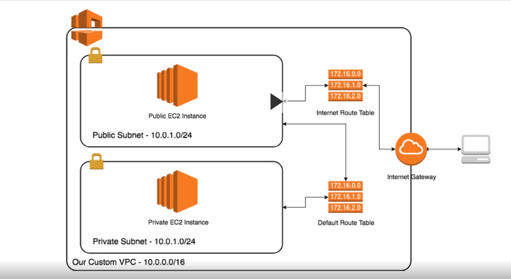

# vpc-simple - boto3

## Resources

- Niyazi Erdoğan's AWS, Python and Boto O'Reilly Course [[video]](https://learning.oreilly.com/videos/managing-ec2-and/9781838642938) [[github]](https://github.com/neocorp/python-boto3-vpc_and_ec2)
- Boto3 EC2 Docs [[link]](https://boto3.amazonaws.com/v1/documentation/api/latest/reference/services/ec2.html)
## Architecture

## To run

    (venv) src $ python main.py preparevpc
    ...
    